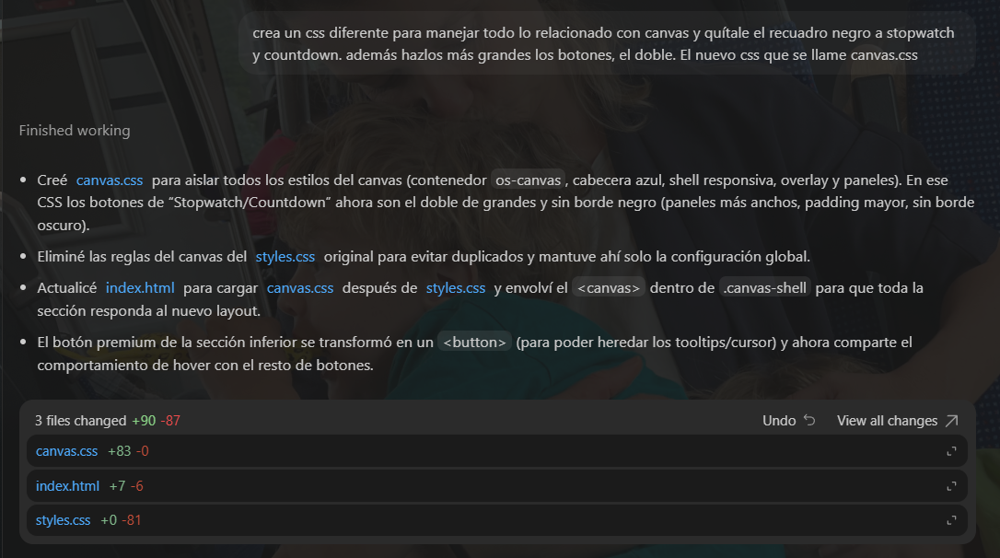

# IA-USO

Registro del uso de inteligencia artificial durante el desarrollo del reto Teaching Assistant – Online Stopwatch. El documento sirve como bitácora y guía para entender cómo la IA ayudó a levantar el canvas, el cronómetro clásico y la documentación.

---

## Modelos empleados

- **ChatGPT (Codex CLI · GPT-4.1/4.1-mini)**  
  Asistente principal para idear la estructura del canvas, ajustar animaciones, generar popups multimedia y redactar documentación.
- **Apify + GPT extractor (referencia inicial)**  
  Se consultó una vez al inicio para obtener un snippet del sitio original; sirvió como referencia del layout base, pero se reescribió por completo al carecer de laps/milisegundos.

---

## Prompts / hitos destacados

1. **“vamos a empezar a crear el canvas… está en el centro”**  
   Resultado: estructura `canvas-shell`, importación de flechas y render inicial con dos paneles (Stopwatch/Countdown).
2. **“haz que aparezca cursor pointer cuando hago hover encima de las flechas”**  
   Resultado: `getHomePanels()` + listeners `mousemove` que actualizan `canvas.style.cursor` según la sección.
3. **“cuando pulso la flecha de stopwatch quiero que parezca que rota”**  
   Resultado: animación de rotación + transición; luego se simplificó a desplazamiento horizontal cuando se pidió un efecto sólo en eje X.
4. **“cuando pulso Start debe comenzar la cuenta”**  
   Resultado: `state.timer`, `handleStartButton`, `getTimerSnapshot`, botones Start/Pause/Continue/Clear y registro de laps dentro del canvas.
5. **“el Countdown necesita el mismo display y números debajo”**  
   Resultado: keypad numérico con degradados, soporte de teclado (`0-9`, `Backspace`, `Enter`), estados `input/ready/running` y botones Set/Clear.
6. **“cuando termina la cuenta atrás quiero alarma”**  
   Resultado: uso de `public/audio/alarm-sound.mp3`, flags `alertActive/alertVisible`, parpadeo cada 0.5?s y sólo botón Clear disponible durante la alarma.
7. **“Répl. mínima debe cargar sólo el canvas”**  
   Resultado: hosts `data-canvas-host="full/minimal"`, clase `body.canvas-only-mode` y lógica para mover el `canvas` entre vistas.

*(El resto de prompts fueron ajustes finos: tooltips personalizados, popups multimedia, animaciones premium, etc.)*

---

## Cómo se integró en el flujo

- **Ideación visual**: describí las capturas y la IA propuso la estructura (barras azules, keypad, transiciones). Luego ajusté manualmente el layout, colores y tipografías.
- **Refactor / DRY**: al solicitar “usa el mismo código para ambos displays”, surgió el helper `drawTimerDisplay`, evitando duplicaciones en stopwatch/countdown.
- **Depuración guiada**: cuando el hover dejó de responder en Countdown, la IA detectó que el listener sólo revisaba `controlZones` del Stopwatch; se extendió la lógica inmediatamente.
- **Documentación**: la IA ayudó a condensar los requisitos y a redactar `README.md` e `IA-USO.md`, cumpliendo los entregables solicitados.

---

## Reflexión personal

- **Qué ayudó**: usar la IA como “pair programmer” visual. Pedirle transiciones específicas o réplicas a partir de capturas aceleró las iteraciones y reforzó la coherencia entre vistas.
- **Qué no ayudó**: los primeros prompts a Apify fueron muy generales; devolvieron un snippet sin lógica real. Aprendí a pedir secciones concretas (botones, laps, milisegundos) para evitar retrabajo.
- **Aprendizajes**:
  - Mantener un estado explícito (`state.timer`, `state.countdown`, flags de alarma) simplifica pedir cambios incrementales a la IA sin romper otros flujos.
  - Conviene desactivar tooltips/overlays globales cuando se trabaja con canvas interactivo.
  - Documentar cada intervención desde el inicio facilita preparar este archivo sin rehacer todo el historial.

En resumen, la IA funcionó como un copiloto enfocado en UI/UX y documentación; yo validé la funcionalidad, limpié el código y aseguré que el resultado coincidiera con la maqueta real.
